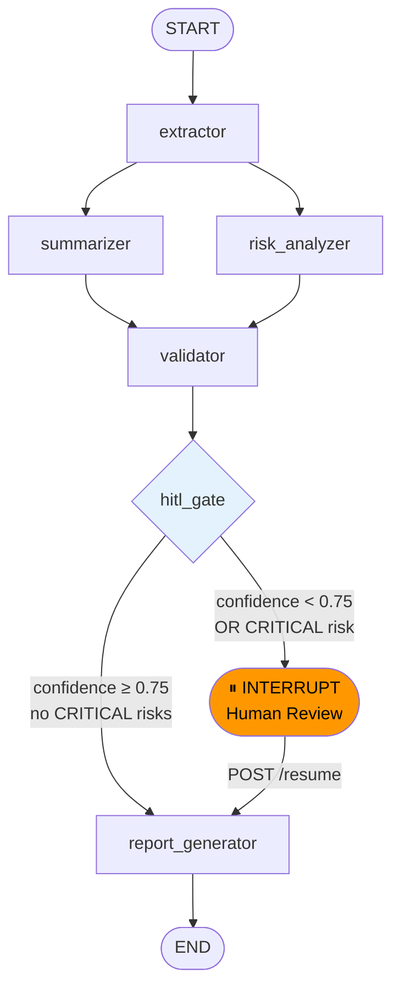

# Contract Risk Analyzer


> **Multi-agent contract analysis system.** Upload a PDF contract and receive a structured risk report with severity classification, clause references, and actionable recommendations — streamed in real-time via Server-Sent Events.

---

## Graph Architecture



---

## Architecture Decisions

| Decision | Choice | Why |
|----------|--------|-----|
| **Graph orchestration** | LangGraph `StateGraph` | Native support for parallel fan-out (`Send()`), checkpointing, and HITL interrupts. CrewAI/AutoGen were considered and rejected — they abstract away too much control. |
| **LLM integration** | LangChain wrappers only | LangChain for loaders and `.with_structured_output()` only. LangGraph is the actual orchestrator. This is the correct separation. |
| **Structured outputs** | Pydantic v2 + `.with_structured_output()` | Forces the LLM to return JSON that matches the schema at the API level (function calling), not by prompt engineering alone. More reliable than parsing free text. |
| **Checkpointing** | DynamoDB via `DynamoDBSaver` | Enables HITL resume from any checkpoint. The graph survives Lambda cold starts and API timeouts. |
| **PDF extraction** | PyMuPDF (fitz) | 3-5× faster than pdfplumber on typical legal PDFs. Better handling of embedded fonts and multi-column layouts. |
| **Streaming** | FastAPI `StreamingResponse` + SSE | SSE is simpler than WebSockets for one-way server→client streams. No reconnection logic needed for the analysis use case. |
| **Observability** | LangSmith + structlog | LangSmith gives per-LLM-call tracing. structlog gives structured JSON logs for CloudWatch. Both complement each other. |
| **Local dev** | LocalStack + Docker Compose | Zero real-AWS cost during development. S3 and DynamoDB APIs are identical, so the same boto3 code runs everywhere. |

---

## Quick Start

```bash
# 1. Clone and configure
git clone https://github.com/your-user/agentic-contract-analyzer
cd agentic-contract-analyzer
cp .env.example .env
# Edit .env: add your OPENAI_API_KEY

# 2. Start infrastructure (LocalStack + API)
make up

# 3. Analyse a contract
curl -X POST http://localhost:8000/analyze \
  -F "file=@tests/fixtures/sample_contracts/sample_contract.pdf" \
  -H "Accept: text/event-stream" \
  --no-buffer
```

Or run locally without Docker:

```bash
pip install -e ".[dev]"
make setup-local-aws   # requires LocalStack running separately
make run
```

---

## API Reference

### `POST /analyze`
Upload a PDF contract. Returns an SSE stream.

```bash
curl -X POST http://localhost:8000/analyze \
  -F "file=@contract.pdf" \
  -H "Accept: text/event-stream"
```

**SSE Events emitted:**
```json
{"event": "node_completed", "node": "extractor", "status": "success", "timestamp": "..."}
{"event": "node_completed", "node": "summarizer", "status": "success", "timestamp": "..."}
{"event": "node_completed", "node": "risk_analyzer", "status": "success", "timestamp": "..."}
{"event": "node_completed", "node": "validator", "status": "success", "timestamp": "..."}
{"event": "human_review_required", "run_id": "abc-123", "reason": "CRITICAL risk detected"}
{"event": "analysis_completed", "run_id": "abc-123", "timestamp": "..."}
```

### `GET /runs/{run_id}`
Get current run status.

### `POST /analyze/{run_id}/resume`
Resume a paused HITL run.

```bash
curl -X POST http://localhost:8000/analyze/abc-123/resume \
  -H "Content-Type: application/json" \
  -d '{"action": "approve", "notes": "Reviewed with legal team. Proceed."}'
```

### `GET /health`
Health check for load balancer probes.

---

## Example Output

```json
{
  "document_id": "a1b2c3d4-...",
  "executive_summary": "Software development services contract between ABC S.L. and Tech Solutions Ltd. for 60,000 EUR over 12 months. Contains aggressive penalty clauses and automatic renewal without adequate notice.",
  "key_parties": ["ABC S.L.", "Tech Solutions Ltd."],
  "contract_duration": "12 months (01/03/2025 – 28/02/2026)",
  "risks": [
    {
      "risk_id": "risk-1",
      "description": "Daily penalty of 2% with no maximum cap creates unbounded financial exposure.",
      "category": "FINANCIAL",
      "severity": "HIGH",
      "confidence": 0.94,
      "clause_reference": "In case of delay, a daily penalty of 2% of the total contract value will apply.",
      "recommendation": "Cap total penalties at 20% of contract value. Add a force-majeure carve-out.",
      "unverified": false
    },
    {
      "risk_id": "risk-2",
      "description": "Automatic renewal clause with only 15-day cancellation window.",
      "category": "TEMPORAL",
      "severity": "MEDIUM",
      "confidence": 0.81,
      "clause_reference": "The contract renews automatically unless cancelled 15 days before expiry.",
      "recommendation": "Extend notice period to 60 days. Add calendar alert trigger.",
      "unverified": false
    }
  ],
  "total_risks": 2,
  "highest_severity": "HIGH",
  "overall_risk_score": 0.61,
  "global_confidence": 0.88
}
```

---

## Project Structure

```
contract-risk-analyzer/
├── src/
│   ├── graph/
│   │   ├── state.py          # GraphState TypedDict — single source of truth
│   │   ├── graph.py          # StateGraph assembly + compilation
│   │   └── edges.py          # ALL routing logic lives here (never in nodes)
│   ├── nodes/
│   │   ├── extractor.py      # PyMuPDF text extraction + section segmentation
│   │   ├── summarizer.py     # LLM-powered structured summary
│   │   ├── risk_analyzer.py  # Risk identification with severity + confidence
│   │   ├── validator.py      # Cross-reference + global confidence calculation
│   │   ├── hitl_gate.py      # LangGraph interrupt() for human review
│   │   └── report_generator.py  # JSON + Markdown report → S3
│   ├── models/               # Pydantic v2 models (frozen, model_config)
│   ├── services/
│   │   ├── s3_service.py     # S3 operations with @with_retry
│   │   ├── dynamo_service.py # DynamoDB checkpointer + metadata
│   │   └── llm_service.py    # LLM wrapper (OpenAI | Bedrock)
│   ├── api/
│   │   ├── main.py           # FastAPI app
│   │   ├── routes/analyze.py # /analyze, /runs/{id}, /resume endpoints
│   │   └── streaming.py      # SSE event generator
│   └── utils/
│       ├── retry.py          # @with_retry decorator (sync + async)
│       └── logger.py         # structlog JSON logger
├── tests/
│   ├── unit/nodes/           # Isolated node tests (mocked LLM/S3)
│   ├── unit/utils/           # Retry decorator tests
│   └── integration/          # Full graph run with mocked LLM
├── infrastructure/
│   ├── docker-compose.yml    # LocalStack + API
│   └── localstack-init/      # Auto-creates S3 bucket + DynamoDB table
├── Dockerfile
├── pyproject.toml
├── Makefile
└── .env.example
```

---

## Running Tests

```bash
make test              # All tests
make test-unit         # Unit tests only (fast, no AWS, no LLM)
make test-integration  # Integration tests (mocked LLM)
make test-cov          # With coverage report (requires ≥80%)
```

---

## What I Learned / Key Challenges

### 1. LangGraph parallel fan-out
LangGraph's `Send()` API enables true parallel node execution, but the fan-in (both branches writing to the same state key) requires careful design. I solved it by having both parallel nodes write to different state keys (`summary_output` vs `risk_analysis_output`) and having the validator fan-in naturally by reading both.

### 2. HITL with checkpointing
Implementing HITL correctly requires understanding that `interrupt()` is not a regular function call — it's a LangGraph primitive that serialises the current state to the checkpointer and suspends execution at the OS level. The resume path uses `Command(resume=...)` which replays from the last checkpoint. Getting this right required reading the LangGraph source code, not just the docs.

### 3. Graceful degradation strategy
The real challenge was ensuring the graph never crashes the entire run when one node fails. The pattern I used: every node wraps its logic in `try/except`, appends to `state["errors"]`, and returns `None` for its output key. Downstream nodes check `if state["<node>_output"] is None` and fall back gracefully.

### 4. Structured outputs reliability
Using `.with_structured_output(PydanticModel)` with GPT-4o in JSON mode is far more reliable than parsing free text, but the LLM occasionally produces outputs that don't exactly match the schema (especially for nested models). Pydantic v2's validation layer catches these at the boundary — another reason to always use structured outputs, not strings.

### 5. Async inside sync LangGraph nodes
LangGraph nodes are sync by default. Running `asyncio.gather()` for parallel section summarisation inside a sync context required using `nest_asyncio` when running inside FastAPI's event loop. A cleaner long-term solution would be native async nodes, which newer LangGraph versions support.

---

## Deployment (AWS)

```bash
# Infrastructure as Code (Terraform)
cd infrastructure/terraform
terraform init
terraform plan -var="openai_api_key=sk-..."
terraform apply
```

The Terraform config provisions:
- API Gateway HTTP API
- Lambda function (containerised)
- S3 bucket with versioning
- DynamoDB table (on-demand billing)
- IAM roles with least-privilege policies

---

## License

MIT — see [LICENSE](LICENSE)
